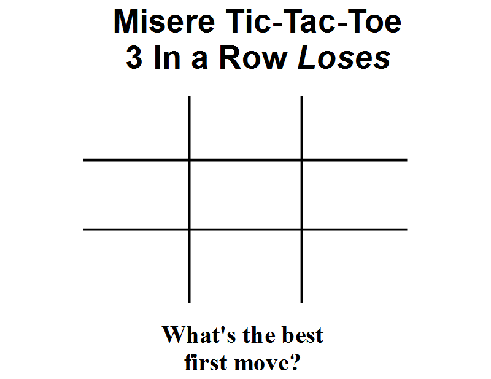

# Misere TicTacToe

Building a reverse version of tic-tac-toe also called avoidance ttt. The Best First Move In Misere Tic-Tac-Toe (3-In-A-Row Is Losing). I have built the game using AI and minimax Algorithm.

In misere tic-tac-toe, you want to avoid strong positions of making 3 in a row. It seems like playing in the center would be bad. However, this is the surprising part of misere tic-tac-toe.

The only non-losing move is the center square! If you play an edge or a corner, you are guaranteed to lose the game against perfect strategy.

Misere tic-tac-toe will always result in a tie, just like regular tic-tac-toe, with proper play.

But how do we know this, and what is that strategy?
